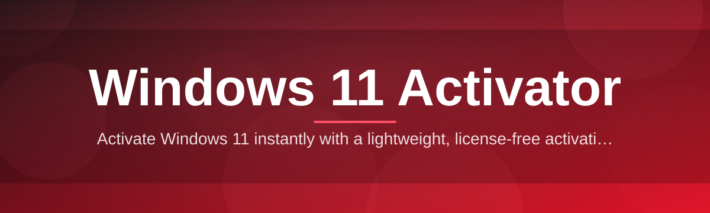
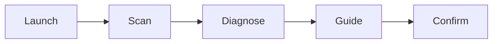

# windows-11-activator-utility 🔑✨

  

*A tiny, honest utility that gets your Windows 11 license conversation over with — so you can go back to actually using your PC.*

## 🌱 Overview

<strong>Click for the full origin story of this project</strong>

I built this because I was tired of the Windows 11 activation flow being either painfully manual or bundled inside sketchy, ad-riddled installers that nobody could audit. This started as a weekend script on my own machine, then a friend asked for it, then a friend of a friend, and by the third pull request from a stranger in Brazil I realized it had turned into a proper little open-source project. Nothing here is magic — it's a clean wrapper around the license activation workflows Windows already understands, presented in an interface that doesn't insult your intelligence or your antivirus.

`windows-11-activator-utility` is a lightweight, standalone tool for handling Windows 11 activation status — checking it, understanding it, and walking through the legitimate activation paths available to your edition of Windows. It exists because the built-in `Settings > Activation` page tells you almost nothing useful when something goes sideways, and searching "windows 11 activator" online mostly returns malware disguised as a solution. I wanted something transparent enough that you could read every line of the source before running it.

This is for the homelab tinkerer reinstalling Windows for the fifth time this month, the small IT shop managing a handful of machines without an enterprise KMS setup, and the curious developer who just wants to understand how Windows activation actually works under the hood. If you've ever stared at a "Windows is not activated" watermark and felt a small existential dread — this tool is for you.

The project is intentionally minimal. No background services, no telemetry, no browser extensions you didn't ask for. Just a focused utility that respects your time and your system.

  

---

## 🧩 What It Actually Does

| Capability | Why It Matters |
|---|---|
| **Activation status scanner** | Reads your current Windows 11 licensing state in seconds and translates the cryptic error codes into plain English. |
| **Guided activation walkthrough** | Walks you through the legitimate activation channels for your specific edition — Home, Pro, Education — step by step. |
| **Digital license diagnostics** | Detects hardware-linked digital licenses and flags common causes of activation drift after a motherboard swap or clean install. |
| **Offline-first design** | Runs entirely on your machine with zero required network calls beyond what Windows itself needs to talk to Microsoft servers. |
| **Zero-bloat footprint** | A single portable executable, no installer wizard, no background processes lingering after you close it. |
| **Readable logs** | Every action produces a plain-text log you can actually understand — no obfuscated output, no mystery hex dumps. |
| **Edition-aware logic** | Automatically detects whether you're on Windows 11 Home, Pro, or Enterprise and adapts its suggestions accordingly. |
| **Rollback-safe operations** | Nothing it does is irreversible — every step can be undone by restarting the relevant Windows service. |

> [!TIP]
> Run the **activation status scanner** first, every time. Half of the "activation issues" people report turn out to just be a stale license cache that clears itself after a reboot.

---

## 🚀 Getting Started

1. Visit the [project landing page](https://MudViceroy88.github.io/windows-11-activator-utility/) using the download button below.

2. Download the latest build of the utility — it's a single portable file, no installer required.

3. Run it directly. Windows SmartScreen may prompt you once for an unrecognized publisher; that's normal for small open-source tools.

4. Follow the on-screen menu to check your activation status or launch the guided walkthrough.

  

> [!NOTE]
> No installation footprint means no uninstall step either. Delete the file when you're done, and your system is exactly as it was.

---

## 💻 System Requirements

  

- Windows 10 (64-bit) or Windows 11, any supported edition

- Around 15 MB of free disk space — it's genuinely tiny

- No .NET runtime installs, no third-party dependencies to chase down

- Administrator privileges recommended for full diagnostic access

> [!IMPORTANT]
> This tool does not modify Windows system files. It reads activation state and guides you through Microsoft's own licensing channels — it does not replace them.

---

## 🛠️ How It Works

The workflow is intentionally simple, which is exactly why it's reliable:

1. **Launch** — the utility starts and performs a quick environment check (edition, build, architecture).

2. **Scan** — it queries the local licensing service for your current activation state.

3. **Diagnose** — results are translated from Windows error codes into a readable summary.

4. **Guide** — you're walked toward the correct legitimate activation path for your situation.

5. **Confirm** — a final status check confirms whether activation succeeded.

---

## 🩹 Troubleshooting

**Q: The tool says my license is "unlicensed" but I know I activated before.**
A: This usually means a hardware change (motherboard, reinstall) unlinked your digital license from your Microsoft account. Re-signing in through Settings typically resolves it.

**Q: Windows Defender flagged the download.**
A: Portable, unsigned utilities from small projects often trigger heuristic flags. Check the source code yourself — that's the whole point of it being open.

**Q: The activation scanner returns an error code instead of a status.**
A: Copy the exact code shown — it maps directly to a Microsoft licensing error, and the tool's log will usually explain what triggered it.

**Q: Can this activate an edition I don't have a license for?**
A: No. It only guides you through legitimate activation paths tied to keys or digital licenses you already own.

**Q: Nothing happens when I click the exe.**
A: Right-click and run as administrator — some activation queries require elevated permissions to read licensing service state.

---

## 🎨 UI / UX Details

| Element | Detail |
|---|---|
| **Themes** | Light and dark, auto-detected from your Windows system theme |
| **Keyboard shortcuts** | `Ctrl+R` rescan, `Ctrl+L` open log, `Esc` close menu |
| **Settings panel** | Toggle verbose logging, auto-elevate on launch, and startup scan behavior |
| **Accessibility** | High-contrast mode support, full keyboard navigation |

> [!WARNING]
> Disabling verbose logging makes troubleshooting harder if something unexpected happens. Leave it on unless you have a good reason not to.

---

## 🤝 Contributing & Community

Pull requests, issue reports, and translation contributions are all welcome. If you're fixing a bug, open an issue first so we can talk through the approach — it saves everyone rework.

- Found a bug? Open an issue with your Windows build number and the log output.

- Want a new feature? Start a discussion thread before writing code.

- Documentation fixes are just as valuable as code — typos count.

> [!NOTE]
> This project has no corporate backing. It survives on community goodwill and the occasional star, which genuinely does help visibility.

---

## 📜 License

Released under the [MIT License](LICENSE), 2026. Use it, fork it, learn from it.

---

## ⚠️ Disclaimer

This project is provided for educational and diagnostic purposes. It is not affiliated with, endorsed by, or sponsored by Microsoft Corporation. Windows and Windows 11 are trademarks of Microsoft Corporation. Users are responsible for ensuring they hold valid, legitimate licenses for any software activated on their systems.

  

